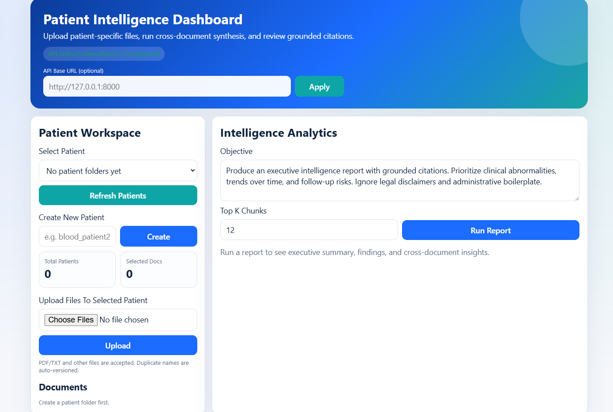
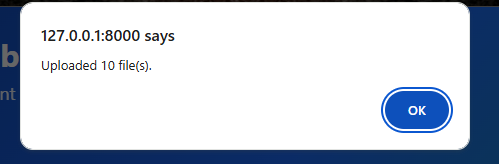
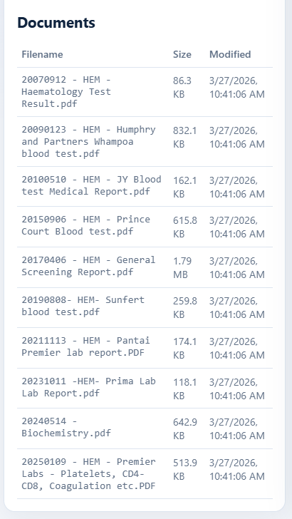
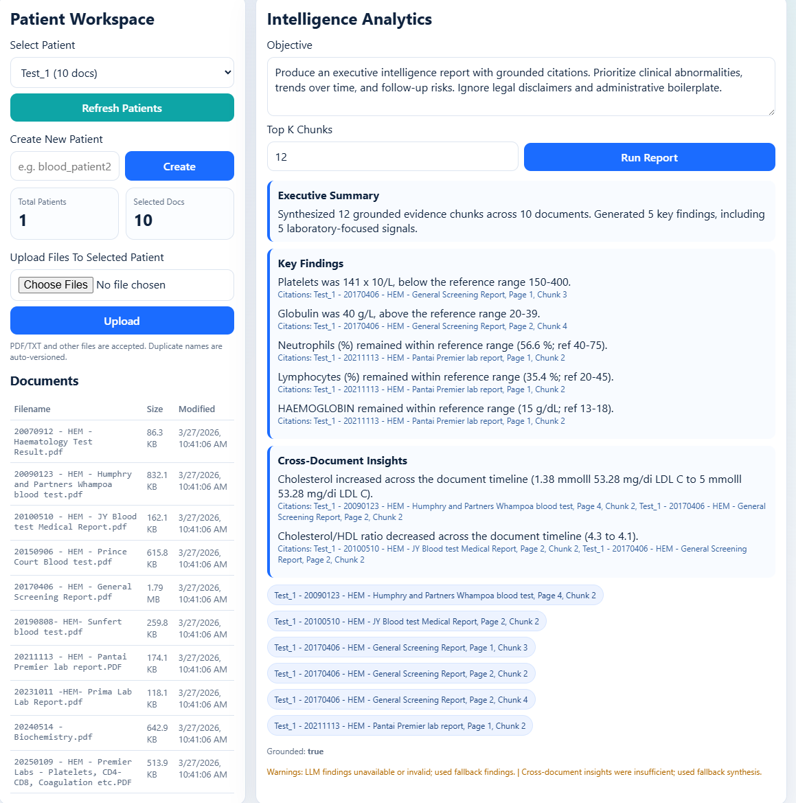

# Medical Document Intelligence

FastAPI-based clinical document analysis system for patient-specific PDF ingestion, OCR-backed parsing, cross-document reasoning, and grounded report generation with evidence citations.

## Overview

Medical documents are often fragmented across multiple reports, formats, and timelines. This project turns scattered patient PDFs into a structured intelligence workflow that can extract content, synthesize findings across documents, and generate citation-grounded summaries for faster review.

The system supports patient-specific document workspaces, multi-file upload, OCR fallback for scanned PDFs, evidence retrieval, and cross-document synthesis through a dashboard-based workflow.

## Key Features

- Patient-specific workspace for organizing uploaded documents
- Multi-page PDF and text document ingestion
- OCR fallback for scanned medical pages
- Chunking and retrieval of grounded evidence
- Cross-document reasoning across a patient timeline
- Executive summary, key findings, and cross-document insights
- Citation-backed outputs in `Document, Page, Chunk` format
- FastAPI backend with dashboard interface
- Regression tests for health, report, and patient workflow APIs

## Demo Screenshots

### Dashboard


### Upload Workflow


### Document Listing


### Grounded Report Output


## How It Works

```text
Patient Documents
      ↓
PDF/Text Parsing
      ↓
OCR Fallback (for scanned pages)
      ↓
Chunking + Evidence Retrieval
      ↓
Cross-Document Synthesis
      ↓
Grounded Findings with Citations
```

## Architecture

```text
app/
|- main.py                    # FastAPI routes
|- schemas.py                 # Request/response contracts
|- prompts.py                 # Prompt templates for QA/extraction/synthesis
|- services/
|  |- llm.py                  # LLM provider layer (Ollama + OpenAI-compatible)
|  |- parser.py               # PDF/text parsing + optional OCR
|  |- retriever.py            # Chunking + ranking for grounded context
|  |- extractor.py            # Structured medical field extraction
|  |- synthesizer.py          # Cross-document report generation
|  |- patient_store.py        # Patient folder/document management
|  `- router.py               # Orchestration glue
`- static/
   `- dashboard.html          # Frontend dashboard
```

## Tech Stack

- Python
- FastAPI
- HTML / JavaScript dashboard
- OCR pipeline with Tesseract support
- Ollama / OpenAI-compatible LLM adapter
- Retrieval-based evidence ranking
- Pydantic schemas
- Pytest regression testing

## Example Workflow

1. Create or select a patient workspace
2. Upload patient PDFs
3. Parse and extract machine-readable content
4. Retrieve the most relevant evidence chunks
5. Generate an executive intelligence report
6. Review findings with grounded citations

## API Endpoints

- `GET /`
- `GET /health`
- `GET /api/health`
- `GET /dashboard`
- `POST /ask`
- `POST /extract`
- `POST /report`
- `GET /patients`
- `POST /patients`
- `GET /patients/{patient_id}/documents`
- `POST /patients/{patient_id}/upload`
- `POST /patients/{patient_id}/report`

## Quick Start

```powershell
python -m venv .venv
.\.venv\Scripts\Activate.ps1
pip install -r requirements.txt
copy .env.example .env
uvicorn app.main:app --host 0.0.0.0 --port 8000 --reload
```

Open:

- Dashboard: `http://127.0.0.1:8000/dashboard`
- API docs: `http://127.0.0.1:8000/docs`
- Health: `http://127.0.0.1:8000/health`

## Local Model Setup

This project defaults to `ollama` for local inference.

```powershell
ollama pull llama3.1
```

Example `.env` settings:

```env
LLM_PROVIDER=ollama
OLLAMA_BASE_URL=http://127.0.0.1:11434
OLLAMA_MODEL=llama3.1
```

## OCR Support

OCR is enabled by default for scanned PDFs and requires Tesseract installed locally.

Example:

```env
TESSERACT_CMD=C:\Users\<you>\AppData\Local\Programs\Tesseract-OCR\tesseract.exe
```

If OCR dependencies are unavailable, the system still works for text-based PDFs.

## Repository Structure

```text
medical-document-intelligence/
├── app/
├── tests/
├── sample_outputs/
├── .env.example
├── .gitignore
├── README.md
└── requirements.txt
```

## Privacy Note

This repository is a sanitized portfolio version of the project. Original source documents and sensitive data are not included. Sample outputs and screenshots are provided for demonstration purposes only.
